# ESP32 Marauder - Double Barrel 5G - ESP32-C5 User Manual 

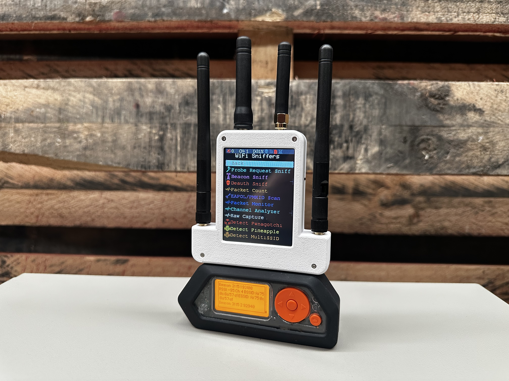
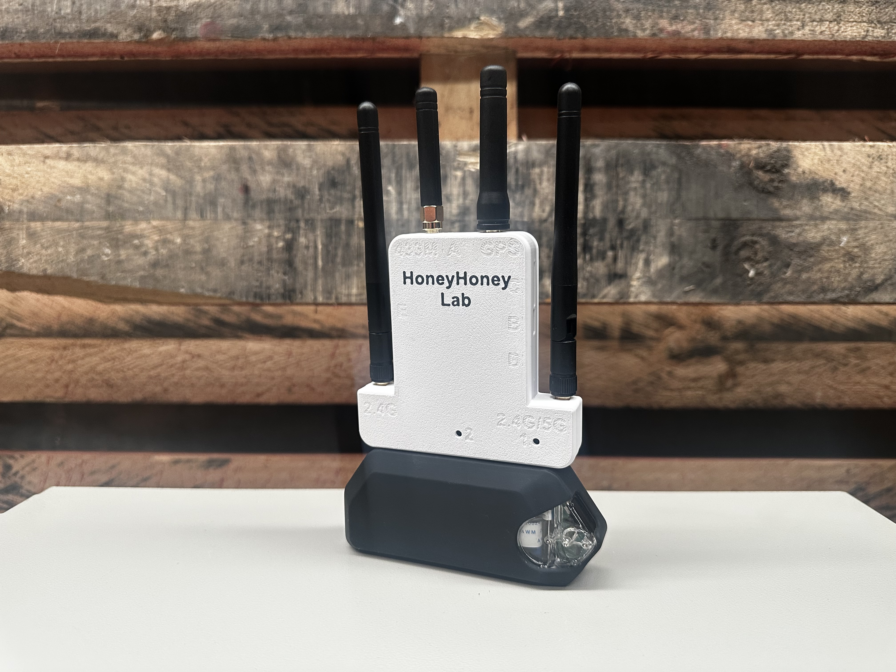
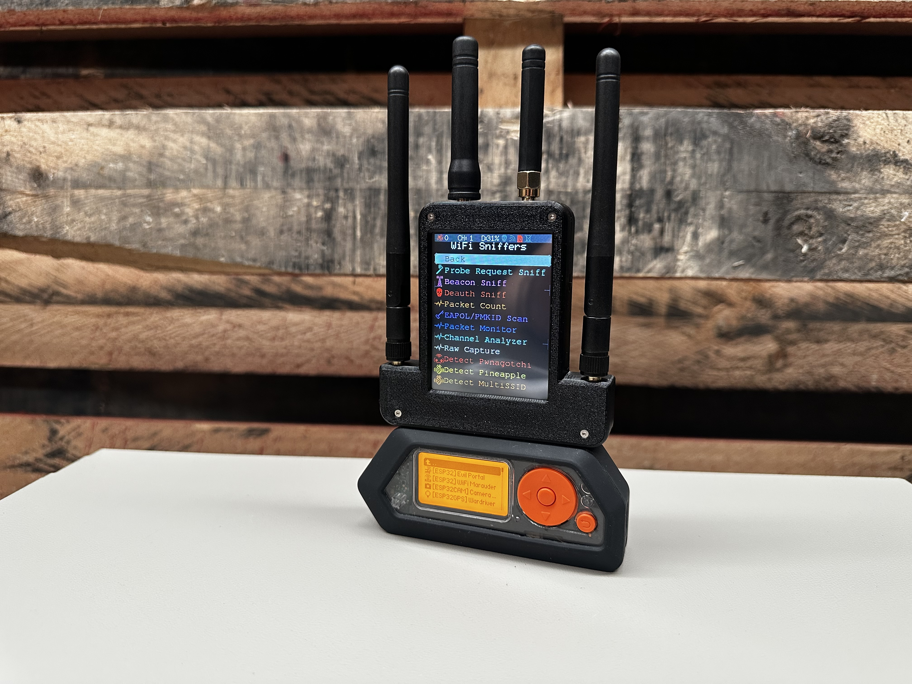
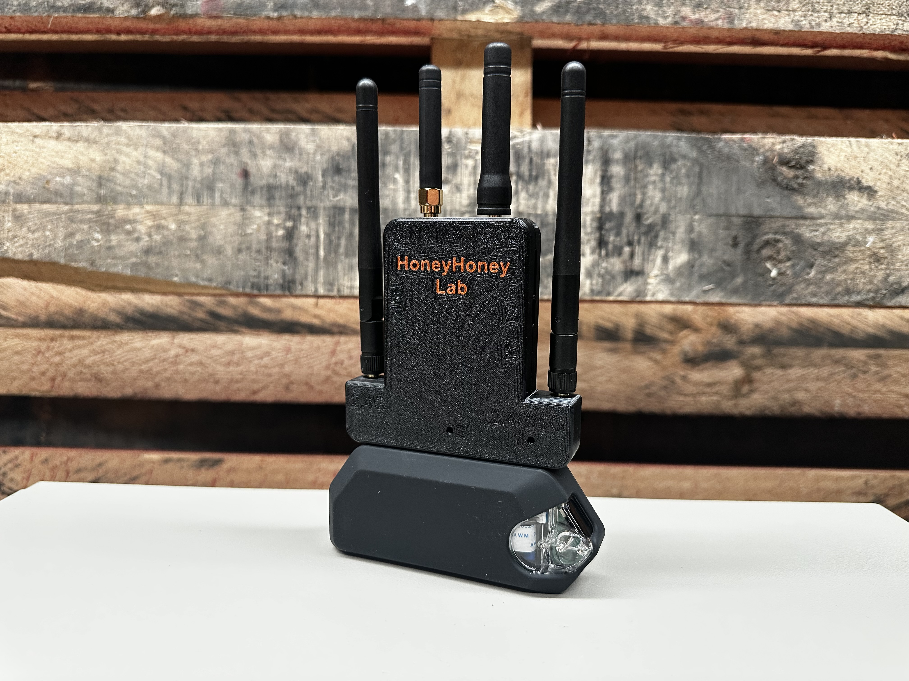
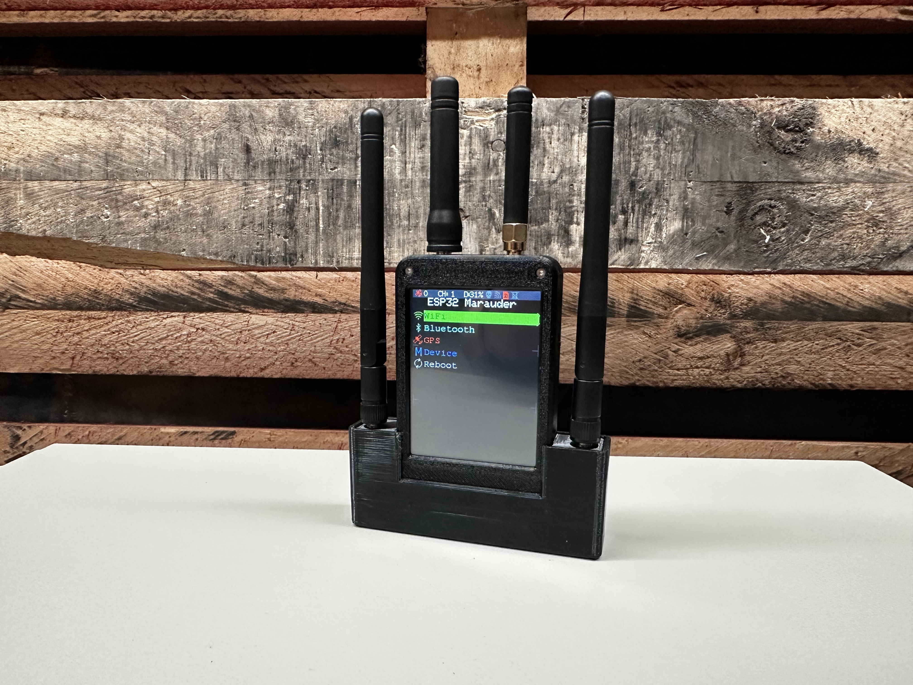
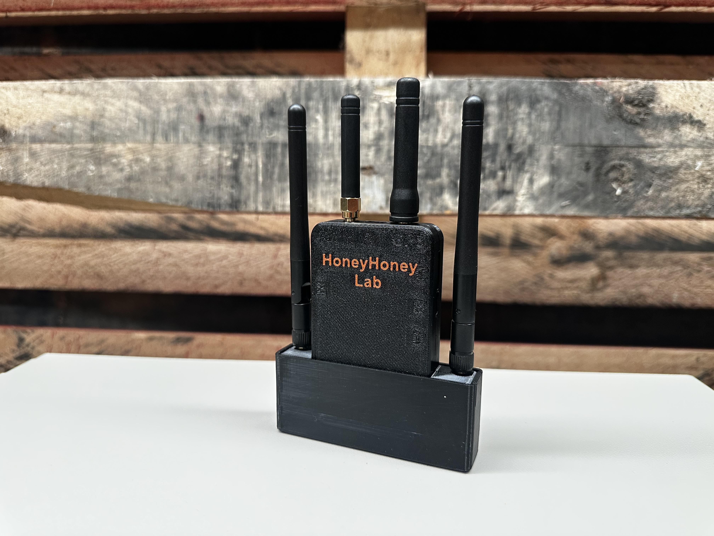

> [!NOTE]
> - Batch 1 units will be available to order on [Tindie](https://www.tindie.com/products/honeyhoneytrading/esp32-marauder-double-barrel-5g/) from 29 Oct 2025, and will ship out on Friday 31 Oct 2025
>   
> - 03 Nov 2025 - 1 * update - Marauder v1.8.7 Freezes When Using a Micro SD Card — Causes and Solutions  -  Anson C. @ Honey Honey Team. 
> - 01 Nov 2025 - 2 * major updates — instructions on revising a bricked device and updating the ESP32-C5 firmware - by John @ Honey Honey Team.
> - 28 Oct 2025 - First version of this Manual - by Anson C. @ Honey Honey Team
> 
> - All procedures and descriptions related to the Flipper Zero herein were validated using Momentum Firmware, version < MNTM-010 30-04-2025 >.

 

## What is ESP32 Marauder - Double Barrel 5G? 
First of all, what is the [ESP32 Marauder Double Barrel](https://github.com/HoneyHoneyTeam/ESP32-Marauder-Double-Barrel)? 

"Double Barrel" refers to the fact that the device runs two separate Marauders simultaneously. The first Marauder features a 2.8-inch screen, an onboard 800mAh battery, GPS, and a microSD card slot. The second Marauder is connected to and controlled by the Flipper Zero.

Previously, the Marauder firmware could only handle 2.4 GHz Wi-Fi due to the limitations of legacy ESP32 chipsets. To overcome this restriction, in early 2025 we implemented the BW16 Kit / RTL8720DN chipset, enabling 5 GHz Wi-Fi capabilities for the 5G cousin of Double Barrel (ESP32 Marauder - Double Barrel 5G - BW16).

Now, with the introduction of the ESP32-C5 chipset, the 5 GHz limitation of the Marauder firmware has been lifted. As a result, we are moving the Double Barrel 5G forward with this new chipset (ESP32 Marauder - Double Barrel 5G - ESP32-C5), 

For more technical details, please refer to the following comparison chart.

 

## Technical specification comparison between Double Barrel models

To date, there are three main iterations of the Double Barrel, primarily distinguished by the chipset each version uses.

## Specification of the ESP32 Marauder Double Barrel 5G

- **The first Marauder comes with:**
	- ESP32 chipset with an external antenna
	- A 2.8-inch touch screen
	- An 800mAh embedded battery
	- Onboard GPS access
	- Micro SD card slot, for updating firmware and data storage (Port C)
    - ESP32 refresher embedded, alternative way for updating firmware	
	- USB-C port for charging and access to ESP32 refresher (Port A)
  	- This part of the device can funcation as a standalone device (i.e., you can use it without Flipper Zero).
   	- The hardware version of this marauder is V6

- **ESP32-C5 chipset is controlled by the Flipper Zero, it comes with**
  	- ESP32-C5 chipset with an external antenna
  	- Pre-loaded with Marauder firmware
  	- ESP32 fresher function has been embedded. Updating firmware can be used via USB-C port directly (Port B)

- **Others:**
	- USB-C Ports for onboard battery charging (Port A).
 	- CC1101 Chipset(433 MHz), supporting up to 10 dB output per antenna.
  	- GPS Chipset. GPS data is accessible to both Marauders.
  	- Four Antennas: 2 x 3 dB for Wi-Fi (Dual Marauder), 1 x 1 dB for GPS, and 1 x 3 dB for SubGhz 433 MHz.
  	- Full 3D-Printed Enclosure/Case is also included.
  	- 1 * metal stylus
  	- Long term tech support via email and Whatsapp Support account

 

## Pre-flight Check / Settings Before First Use 

> [!NOTE]
> All our products are thoroughly checked and configured prior to shipping. While most of our products are plug-and-play, a few specific settings need to be adjusted on your Flipper Zero to ensure proper communication with the Double Barrel 5G.

 

### SubGhz <433mhz>
- **No initial setup is required for SubGhz chipset detection**. The Flipper Zero automatically recognizes an external SubGhz chipset when it connect to The Double Barrel 5G. 
- To confirm if the Flipper Zero is using the external SubGhz chipset, or to switch to it manually:
	1. On your Flipper Zero, navigate to the main menu.
	2. Go to: **Sub-Ghz** -> **Radio Settings** -> **Module**.
	3. Select **External**."
- The SubGhz part of the Double Barrel is fully functional even the first marauder is in OFF mode

 

### 1st Set Marauder / Standalone section (The one with 2.8inch Touch Screen)

- No initial setup is required
- Turn ON or OFF via the switch located on the right side of the Double Barrel / (labeled <**D**>)
- If you would like to update the firmware, please remeber to download **V6 version** of the firmware BIN file

 

### 2nd set Marauder - ESP32-C5

- The ESP32-C5 part use UART 15 and 16 for communicating with Flipper, hence it is necessary to switch from the default 13 & 14 GPIO to 15 & 16.
	1. On your Flipper Zero, navigate to the main menu.
	2. Go to: **Momentum** -> **Protocols** -> **GPIO Pins** -> **ESP32/8266 UART**.
	3. Select **Extra 15, 16**.

- After this, you could use Marauder as usual. Those 5G WiFi should be accessable from this point forward.  
  	   
 

### GPS

- To use the GPS function of Double Barrel 5G via the Flipper Zero, please see the steps below.
  	1. On your Flipper Zero, navigate to the main menu.
	2. Go to: **Momentum** -> **Protocols** -> **GPIO Pins** -> **NWEA GPS UART**.
	3. Select **Extra 15, 16**.
	4. If **ESP32/8266 UART** setting is also set as **Extra 15, 16**, please change to **Default 13, 14**. The reason is that only one function can use UART pins 15 and 16 at a time. If both the ESP32 and the GPS are set to use UART 15 and 16, it may cause a functional conflict.
	5. For testing purpose, Go to **Apps** -> **GPIO** -> **[NMEA]GPS**.
	6. Acquiring a GPS signal might take up to a minute. The exact time depends on your location and how open or obstructed the sky is.

 

## How to upgrade Marauder firmware via Micro SD card

 Click the Triangle for more details   

### 1st Set Marauder (The one with 2.8inch Touch Screen)

1. Take the Micro SD card from the Double Barrel and connect to an PC / Laptop / Mac / whatever

2. Download the **V6** firmware file, which is usual inclued < **_new_hardware.bin/_v6.bin** > in the name, from [Marauder website](https://github.com/justcallmekoko/ESP32Marauder/releases).
   
3. **PLEASE PLEASE PLEASE double check which version of Marauder you have downladed and used. 
   
4. When you have checked the bin file, copy the file to the Micro SD card and rename it as< **update.bin** >. Then, insert the Micro SD card back into the Marauder Unit.

5. Please double-check that you have downloaded the correct file and verify its size to ensure it wasn't corrupted during the download process. Using the wrong or a corrupted firmware file may brick the device. If that happen, pleases check [this tutorial of how to revive / recovery the device](https://github.com/HoneyHoneyTeam/ESP-Programmer-for-Slim-Jim-Double-Barrel-Double-Barrel-5G). 
   
6. Turn on the Marauder Unit, Navigating menu as following: < **Device** > => < **Update firmware** > => < **SD Update** > => < **Yes** >. In rare cases, Marauder may repeatedly show that the firmware file is corrupted and exit the update process shortly, no matter how many times you try. We suggest using a new microSD card in such cases.
   
7. In a minute, The unit should restart itself and you are golden.

 

## How to upgrade firmware via USB-C // How to revive a bricked device 

 Click the Triangle for more details   

 

Here is alternative way to upgrade firmware via USB-C port. This method can also be used if the device becomes bricked due to installing the wrong firmware or corrupted firmware files. A bricked device is one that fails to boot properly—its screen remains black when powered on.

### Downloading the necessary files & App

Before starting, please download the necessary software and files. In this guide, we will be performing the procedure on Microsoft Windows 11. 

- [Flash Download tools from Espressif](https://www.espressif.com/en/support/download/other-tools)
- Four Marauder files from [the Marauder GitHub](https://github.com/justcallmekoko/ESP32Marauder/wiki/update-firmware), from the "ESP32 Marauder v4, v6, Kit, Mini" column:

1. Bootloader
2. Partitions
3. Boot App
4. Firmware (any version you prefer, preferably the latest one)

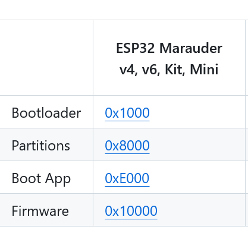

 

### Ready to go

1. When all the files are downloaded and ready, run "**Flash Download Tools**" and set the options as shown in the following two pictures. 
   
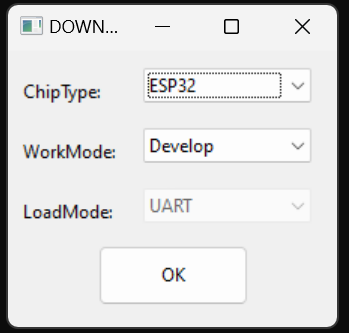

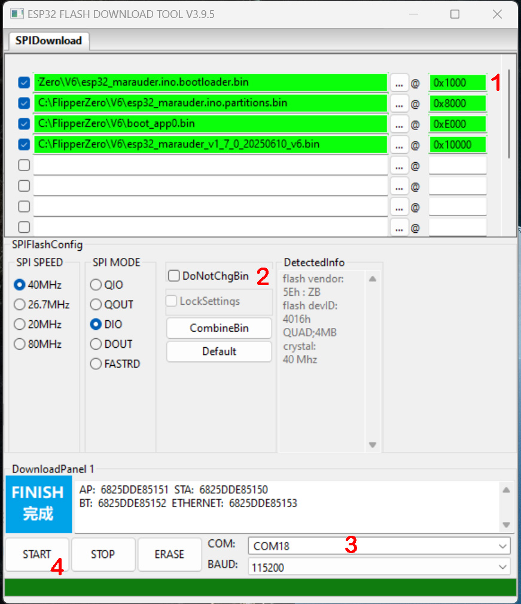

 

2. Connecting the unit to your PC or Mac via the USB-C port on top of the device, which is marked as "A". Make sure the USB-C cable is capable for data transfer, If you are not sure what is that mean, use the cable coming with the package. 

2. Next,  while **holding down the boot button (marked as "2" on the back of the device)**, with the metal stylus included with the Double Barrel, then turn on the device with on/off swith (marked as "C"). These two actions must be performed simultaneously 

3. Return to Flash Download Tools, select the **COM** in the lower right cornor (the one marked with 3 in the picture) and click Start.

4. If everything goes as planned, the software will handle the rest in a minute.

 

## How to switch firmware for the standalone section, such as from Marauder to Bruce, or vice versa

 Click the Triangle for more details

**Notes: Based on our testing < 18.June.2025 >, Bruce firmware can be load into the standalone section of Double Barrel / Double Barrel 5G. but it is still a bit buggy, and not 100% of Bruce funcationality is fully supported, which is understandable**

1. [An ESP32 programmer](https://github.com/HoneyHoneyTeam/ESP-Programmer-for-Slim-Jim-Double-Barrel-Double-Barrel-5G) is included in the package. Connecting the programmer to the GPIO port located in the lower-right corner of the device, as shown in the following picture.

2. Using Google Chrome, go to [Bruce.Computer website](https://bruce.computer/flasher). At the bottom of the page, select '**Latest Release**' -> '**Custom Boards**' -> '**Marauder V4 or V6**' -> '**Install**'
   
3. After that, while **holding down the boot button** (Marked as 2) on the back of the device using a pin or the metal stylus included with the Double Barrel, **connect** the ESP32 programmer to your PC's USB port. This will put the device into bootloader/download mode, as shown in the following picture.

   
4. If everything is set up correctly, you should be able to select the COM port from the prompt window on the Bruce website. The website will handle the rest of the process automatically.
   
5. After about a minute, the website should indicate that the process is complete. You can then disconnect the device—now it's time to explore!

6. What happen if you like to reverse back to Marauder Firmware? Check [this tutorial](https://github.com/HoneyHoneyTeam/ESP-Programmer-for-Slim-Jim-Double-Barrel-Double-Barrel-5G)

 

## How to upgrade ESP32-C5 firmware 

 Click the Triangle for more details

 
	
- When we shipped out the Double Barrel 5G, the ESP32-C5 chipset was pre-loaded Marauder firmware Ver 1.8.5. It is plug and play for most of the users.
  
- Necessary APP(windows Version), Firmware and bins files can be download via [this dropbox link](https://www.dropbox.com/scl/fi/i5mt078kky2rm4br7wxox/flash_download_tool_3.9.9_R2.For.Double.Barrel.5G.C5.Version.zip?rlkey=4fayfh5agvm8hhbbvkqv27oes&st=51wofks6&dl=0)
  
- [Firmware update Demo Video](https://youtu.be/ixN0UpWzVCk)

 

**A short version for users experienced with Espressif’s Flash Download Tool.**

1. Download all the firmware files and set them up as shown in the pictures.
2. While using the metal stylus included in the package to press and hold the button inside the hole marked as “1”, connect the 5G unit to your PC.
3. Next,  click “Start” and let the tool complete the process.
That’s it — done!

**The thorough version in a step-by-step fashion.**

1. Download the [ESP32.C5 firmware files](https://github.com/justcallmekoko/ESP32Marauder/tree/master/C5_Py_Flasher/bins) into your PC/Mac. Link credit to [@JustCallmeKoko](https://github.com/justcallmekoko). 
2. The firmware can be uploaded to the ESP32-C5 chipset using either "Flash Download Tool" provided by Espressif, or via a Python-based flashing script [C5_Py_Flasher](https://github.com/justcallmekoko/ESP32Marauder/tree/master/C5_Py_Flasher), more details please refer to [this guide](https://github.com/justcallmekoko/ESP32Marauder/wiki/ESP32%E2%80%90C5%E2%80%90DevKitC%E2%80%901) In this manual, we will use the “Flash Download Tool” as an example.
3. Setup the tool as showed in the following two picture.
    
   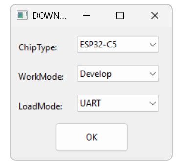
    
   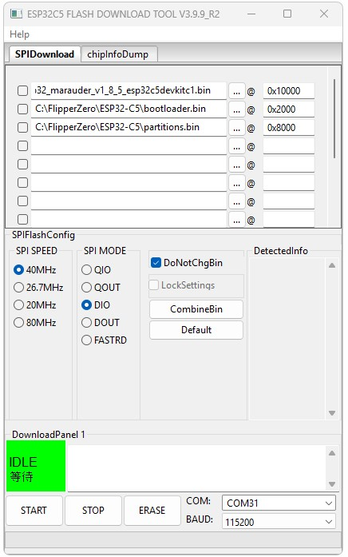
   
4. Use the metal stylus included in the package to press and hold the boot button through the hole on the back of the unit, which is marked as “1”.
5. While holding down the boot button, connect the 5G unit to your PC or Mac using the USB-C port located on the left side of the unit, marked as “B.”
These two actions must be performed simultaneously — pressing and holding the boot button while powering on is the standard procedure for entering bootloader mode on the device.
6. Next, click “Flash.” Allow the application to run for one seconds until the process is complete. When finished, the screen should appear as shown in the following image.
   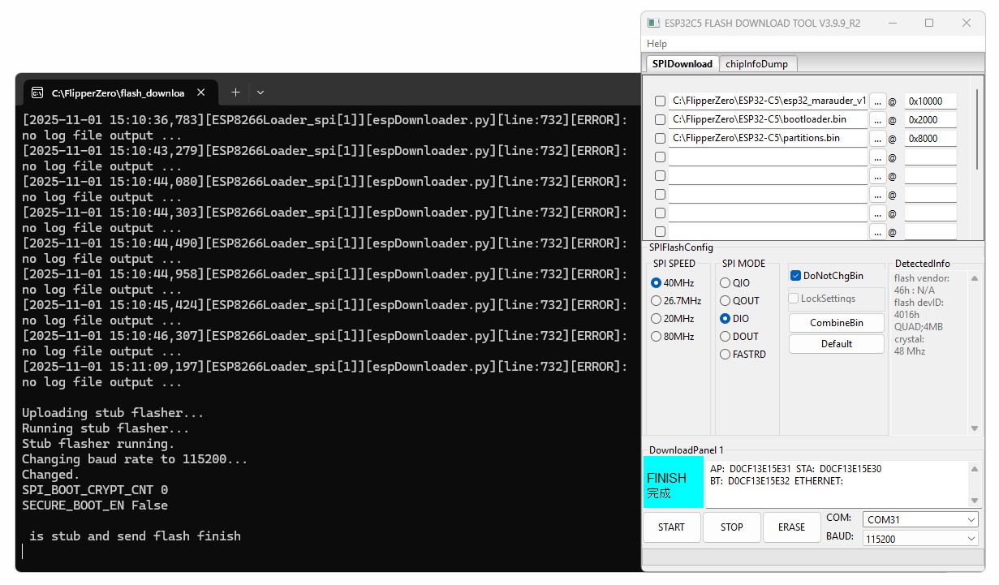

 

## Could the Double Barrel 5G work with other Flipper Zero firmware besides Momentum? 

 Click the Triangle for more details 

 
Update on Aug 2025
 
We believe the Double Barrel 5G is compatible with most firmware versions.

However, there is one caveat. When we checked the latest Unleashed firmware (as of 10 July 2025), we were unable to locate the UART setting for changing the ESP32/8266 GPIO pins (from the default 13/14 to 15/16) in the Unleashed documentation. It’s possible this setting is referred to differently in the Unleashed firmware.

We worked around this by first using a Flipper running the Momentum firmware, where we configured the GPIO pins to 15/16. Then, we used the web installer to flash the Unleashed firmware (version 081). In this case, the update process preserved the existing GPIO configuration.

If you’re planning to use Unleashed with the Double Barrel 5G, this could be one way to get it working.

 

## Marauder v1.8.7 Freezes When Using a Micro SD Card — Causes and Solutions 

 Click the Triangle for more details

 
<Updated: 03/11/2025>
We recently discovered that when using a micro SD card with Marauder version 1.8.7, the system may freeze and become unresponsive to touch input. We currently suspect this issue is related to the 1.8.7 firmware.

To resolve the problem, please avoid using this specific version of Marauder. You can either upgrade to version 1.8.9 or downgrade to another stable version. Unfortunately, upgrading via micro SD is not possible due to the freezing issue. The upgrade must be performed using a USB-C connection and the Flash Download Tool.

For more details, please refer to the section “How to Revive a Bricked Device” in this manual.

An email has been sent to all users who may be affected by this issue.

 

## Our official shop if you would like to support us.  
1. [ESP32 Marauder - Double Barrel 5G via Tindie](https://www.tindie.com/products/39064/)
2. [ESP32 Marauder - Double Barrel via Tindie](https://www.tindie.com/products/38768/)
3. [Our official site](https://honeyhoneylab.com/)
4. [Tindie](https://www.tindie.com/stores/honeyhoneytrading/)
5. ~~[ETSY Shop](https://www.etsy.com/au/shop/HoneyHoneyTrading)~~

 

## Warrenty and Tech Support

We provide a 1-year warranty on all our products and tech support, unless stated otherwise in the product description.

FYI, our [Etsy](https://www.etsy.com/au/shop/HoneyHoneyTrading) shop is no longer in operation. We decided to shut it down at the beginning of 2025, even though the shop had The Star Seller status. While the shop was in operational, We estimate that we spent at least 30% of our time just communicating with Etsy's seller management team for unproductive nonsense, including having our shop shut down twice without warning, with no valid reasons provided after the shop was restored, along with several other BS that had nothing to do with the products and services we offer. 

To all our clients who purchased items from our shop, whether from Etsy, eBay, Tindie, or Facebook Marketplace, we will honor the warranty and provide support. Please feel free to email us at Support@honeyhoneylab.com. or [Whatsapp](https://wa.me/61452559581) 

 

## FAQ 

## Credibility
- Credit of Marauder Firmware goes to <ins>@JustCallmeCoco</ins>
- Credit of delfyRTL goes to [gorebrau](https://github.com/gorebrau/delfyRTL)
- Credit of Bruce firmware goest to [Bruce.computer](https://bruce.computer/) 

 

## Metadata / keywords / about for bots ##
flipper zero, flipper, wifi board, marauder,5G wifi, bw16, network security, esp32, cc1101, nrf24, subghz, 2.4ghz, wifi, GPS
